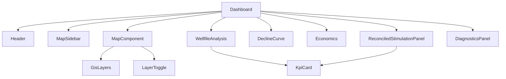

# MT Oil Dashboard — Frontend

React 19 + Vite + TypeScript + Tailwind CSS v4 dashboard for the MT Oil Analytics
Platform. Built with Recharts (charts), react-leaflet (maps), and Lucide (icons).

## Component Hierarchy

## Key Components

| Component          | File                                  | Description                                   |
| ------------------ | ------------------------------------- | --------------------------------------------- |
| `Dashboard`        | `src/Dashboard.tsx`                   | Main layout: sidebar + map + tabbed panels    |
| `MapComponent`     | `src/MapComponent.tsx`                | Leaflet map with well markers, GIS overlays   |
| `GisLayers`        | `src/GisLayers.tsx`                   | React-leaflet layer component for GIS GeoJSON |
| `LayerToggle`      | `src/LayerToggle.tsx`                 | UI toggle to show/hide GIS layers             |
| `MapSidebar`       | `src/components/MapSidebar.tsx`       | Well list and filter sidebar                  |
| `DeclineCurve`     | `src/components/DeclineCurve.tsx`     | DCA chart (Recharts)                          |
| `Economics`        | `src/components/Economics.tsx`        | NPV/ROI/payout card                           |
| `WellfileAnalysis` | `src/components/WellfileAnalysis.tsx` | Agent-powered wellfile extraction UI          |
| `KpiCard`          | `src/components/KpiCard.tsx`          | Reusable KPI metric card                      |
| `Header`           | `src/components/Header.tsx`           | App header with navigation                    |
| `ErrorBoundary`    | `src/components/ErrorBoundary.tsx`    | React error boundary wrapper                  |

## API Client

The API base URL is configured at build time via `VITE_API_BASE_URL`. The client
lives in `src/api/client.ts` and provides typed functions for every endpoint.

## Scripts

| Command         | Description                              |
| --------------- | ---------------------------------------- |
| `npm run dev`   | Start Vite dev server (hot-reload)       |
| `npm run build` | Type-check + production build to `dist/` |
| `npm run test`  | Run Vitest suite                         |
| `npm run lint`  | ESLint                                   |

## Testing

Uses Vitest + @testing-library/react + jsdom. Test files live in `src/test/`
and are co-located with components when applicable.

## Dependencies

- **react-leaflet** / leaflet — map rendering
- **recharts** — DCA and economic charts
- **lucide-react** — icon set
- **axios** — HTTP client
- **sonner** — toast notifications

## Environment Variables

| Variable            | Default                 | Description     |
| ------------------- | ----------------------- | --------------- |
| `VITE_API_BASE_URL` | `http://localhost:8000` | Backend API URL |
