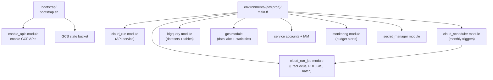

# MT Oil — Infrastructure (Terraform)

Terraform configuration for deploying the MT Oil Analytics platform to Google
Cloud. Uses a GCS remote state backend and Workload Identity Federation for
CI/CD authentication.

## Layout



```
infra/
  bootstrap/              One-time bootstrap script (run locally)
  environments/
    dev/                  Dev environment (main.tf, variables.tf, outputs.tf)
    prod/                 Prod environment (main.tf, variables.tf, outputs.tf)
  modules/
    bigquery/             BigQuery dataset + tables
    cloud_run/            Cloud Run API service
    cloud_run_job/        Cloud Run Job (execution, not serving)
    cloud_scheduler/      Cloud Scheduler trigger
    enable_apis/          GCP API enablement
    gcs/                  GCS bucket with optional website config
    monitoring/           Budget alerts and monitoring
    secret_manager/       Secret Manager secrets
```

## Environments

| Environment | Branch | BigQuery Dataset | Cloud Run Service | GCS Bucket                 |
| ----------- | ------ | ---------------- | ----------------- | -------------------------- |
| Dev         | `dev`  | `mt_oil_dev`     | `mt-oil-api-dev`  | `{project_id}-mt-oil-dev`  |
| Prod        | `main` | `mt_oil_prod`    | `mt-oil-api-prod` | `{project_id}-mt-oil-prod` |

Envs are kept separate but are seeded from the same source data.

## Usage

```bash
cd infra/environments/dev

# Init with remote GCS backend
terraform init \
  -backend-config="bucket=<GCP_PROJECT_ID>-tfstate" \
  -backend-config="prefix=dev/terraform.tfstate"

# Preview changes
terraform plan -var="project_id=<GCP_PROJECT_ID>" -var="region=<REGION>" -var="api_image=<IMAGE_URL>"

# Apply
terraform apply -var="project_id=<GCP_PROJECT_ID>" -var="region=<REGION>" -var="api_image=<IMAGE_URL>"
```

## Bootstrap

`bootstrap/bootstrap.sh` enables core APIs and creates the GCS state bucket.
Run once per project from a developer workstation with sufficient permissions.

## Conventions

- **No hardcoded project IDs / regions** — use variables and `data "google_project"`.
- **Dynamic naming** — derive globally unique resource names from `var.project_id`.
- **Backend blocks empty** — configure remote state via `-backend-config` at `init`.
- **APIs explicitly enabled** — use `google_project_service` with `disable_on_destroy = false`.

## Deployed Resources

- Cloud Run API service (max 1 instance, 2 GiB, CPU throttled)
- Cloud Run Jobs (FracFocus, PDF fetch, GIS update)
- Cloud Scheduler (monthly triggers)
- BigQuery datasets (wells, production_monthly, frac_focus, wellfile_parsed_metadata)
- GCS buckets (data lake, frontend static website)
- IAM service account and role bindings
- Budget alerts ($5/month threshold)
