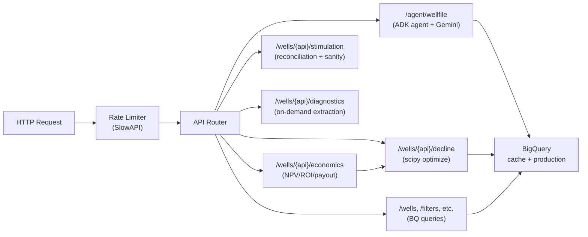

# MT Oil — Backend Package

FastAPI application for Oil & Gas well analytics. Serves the dashboard API,
runs Decline Curve Analysis (DCA), economic modeling, and ML forecasting.

## Request Flow



## Package Layout

```
src/mt_oil/
  api/          FastAPI app, routers, middleware
  agents/       Google ADK agent for wellfile PDF extraction
  data/         Local-file and BigQuery data loaders
  domain/       DCA models (Arps, Duong) and economic calculations (NPV, ROI)
  jobs/         Cloud Run Job entrypoints (FracFocus, PDF fetch, GIS, batch extraction)
  models/       scikit-learn ML pipeline (Random Forest) for BOE prediction
  processing/   Feature engineering and data preprocessing
  schemas/      Pydantic schemas for agent requests/responses
  config.py     Centralized runtime configuration (env-var driven)
```

## API Endpoints

All read endpoints are rate-limited (default 60/min). Write/train endpoints
are limited separately (5/min).

| Method | Path                      | Description                                |
| ------ | ------------------------- | ------------------------------------------ |
| GET    | `/health`                 | Service health + loaded data summary       |
| GET    | `/filters`                | Filter options (formations, types, slants) |
| GET    | `/wells`                  | Paginated well list with optional filters  |
| GET    | `/wells/{api}`            | Single well details                        |
| GET    | `/wells/{api}/production` | Monthly production history                 |
| GET    | `/wells/{api}/wellfile`   | Wellfile PDF URLs (state + GCS fallback)   |
| POST   | `/wells/{api}/decline`    | Fit decline curve (Arps / Duong / auto)    |
| POST   | `/wells/{api}/economics`  | NPV / ROI / payout calculation             |
| POST   | `/train`                  | Trigger ML model retraining (background)   |
| POST   | `/agent/wellfile`         | Agentic wellfile PDF extraction (Gemini)   |

## Data Sources

- **Deployed (Cloud Run):** data is loaded from BigQuery (`mt_oil_dev` / `mt_oil_prod`)
- **Local development:** data is loaded from local `.tab` files via `mt_oil.data.loader`

Toggle with `ENABLE_LOCAL_DATA=true|false` (default: `true` in local, `false` in Cloud Run).

## Configuration

All settings are read from environment variables via `config.py`. Key settings:

| Variable                | Default                    | Description                                |
| ----------------------- | -------------------------- | ------------------------------------------ |
| `ENVIRONMENT`           | `local`                    | env name for logging/telemetry             |
| `GCP_PROJECT_ID`        | —                          | GCP project for BigQuery + GCS             |
| `GCS_DATA_BUCKET`       | —                          | GCS bucket for data / model artifacts      |
| `BIGQUERY_DATASET`      | —                          | BigQuery dataset ID                        |
| `ENABLE_LOCAL_DATA`     | `true`                     | Use local `.tab` files instead of BigQuery |
| `MODEL_PATH`            | `rf_model.joblib`          | Path or `gs://` URI for ML model           |
| `RATE_LIMIT`            | `60/minute`                | Per-IP read rate limit                     |
| `CORS_ORIGINS`          | `FRONTEND_URL`             | Allowed CORS origins                       |
| `VERTEX_AI_LOCATION`    | `us-central1`              | Vertex AI region for Gemini                |
| `VERTEX_AI_MODEL`       | `gemini-2.5-flash-lite`    | Vertex AI model for wellfile extraction    |
| `WELLFILE_PARSED_TABLE` | `wellfile_parsed_metadata` | BQ table for parsed wellfile cache         |
